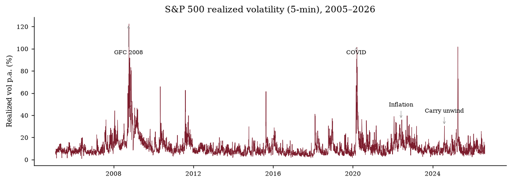
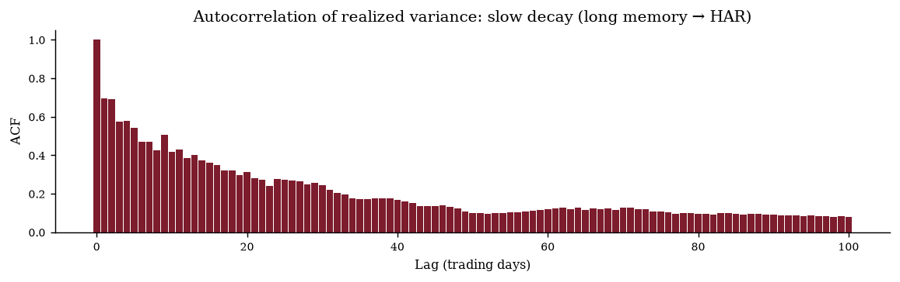
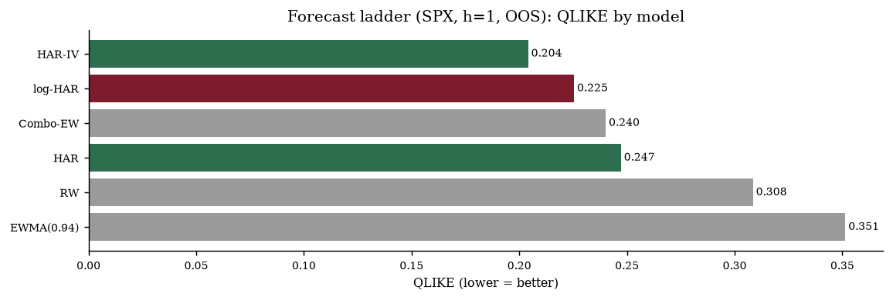
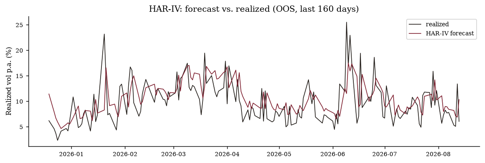
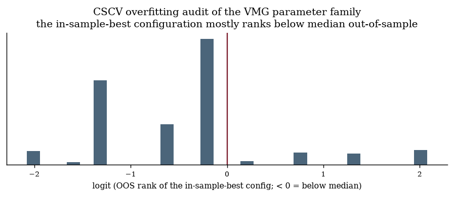
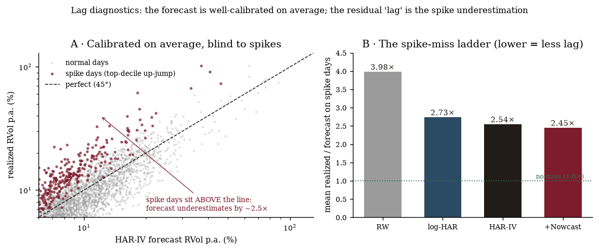

# Realized-Volatility Forecasting and Volatility-Managed Sizing on the S&P 500: A Pre-Registered, Walk-Forward, Multiple-Testing-Corrected Study

**Jonas Löffler** · August 2026 · Working paper, v1.1

> **Research/educational project — not investment advice.** All results are historical
> simulations net of assumed costs on a price index (no dividends). Code, results and the
> pre-registration protocol are public; licensed raw data is not redistributed (sha256
> fingerprints published).

## Abstract

We study realized-volatility forecasting and volatility-managed exposure sizing on 21 years of
1-minute S&P 500 data, conditioned on the VIX term structure, under a validation protocol fixed
**before the first run**: pre-registered hypotheses, grids, costs and ranking rule;
walk-forward parameter selection on training windows only; and multiple-testing corrections
(deflated Sharpe ratio, probability of backtest overfitting via CSCV, block bootstrap) across
the **73 configurations** actually computed. **Two results, of opposite sign.** *Forecasting
holds up:* log-HAR has a lower out-of-sample QLIKE than the random walk, and a nested-MSPE
Clark-West test rejects equal accuracy (p ≈ 0.03); the edge grows with horizon (MSE-based OOS R²
+23 % at h=1 to +43 % at h=22), implied volatility adds information (HAR-IV, Clark-West
p = 0.019), and a rich linear feature set edges HAR-IV through *features* — unregularized OLS
(0.1968) ties Lasso (0.1977) within an un-tested third-decimal difference and gradient boosting
adds nothing on QLIKE (0.2045, DM p = 0.86); a loss-matched Gamma-GLM with the VIX term-structure
slope is the **strongest** of a few candidates to lower *both* QLIKE (−4 %) and MSE, out of sample
and in both sub-periods (DM p = 0.0008, exploratory). A lag diagnostic shows the forecast is well-calibrated on average
(Mincer-Zarnowitz slope ≈ 1, top-forecast-decile ratio 1.08, tail coverage 9.8 %); its visible
"lag" is largely mechanical — of the 2.54× spike-underestimation, a perfectly-calibrated
forecaster already produces ≈ 1.90× (outcome selection under right skew), and only the residual
(+0.64, P < 0.001) is a genuine under-reaction to unanticipated shocks. An intraday nowcast
(first-hour RV, the strongest single lever at −4.8 % QLIKE) is not significant and leaves it at
2.45×, because the worst spikes emerge after the first hour. *The trading strategy does not.* The best walk-forward
volatility-managed / VIX-term-structure combination (Sharpe 0.96, max drawdown −9.9 % vs.
buy-and-hold 0.83 / −34.0 %) is **disqualified by our own pre-registered rules** — probability
of backtest overfitting 0.84 and a single-market effect — its Sharpe advantage is inside the
bootstrap noise band (ΔSharpe +0.13; the combination's and buy-and-hold's 95 % Sharpe intervals,
[0.44, 1.46] vs. [0.28, 1.34], overlap heavily), and its clean
drawdown profile is largely a volatility-level artifact. We report every failure (long/short
momentum, turn-of-month, net overnight carry, a six-test mechanism battery). **The contribution
is the forecasting result and the validation methodology, not a tradeable edge; no result
reaches `supported` status without a live prediction log.**

**Keywords:** realized volatility, HAR, volatility-managed portfolios, VIX term structure,
walk-forward analysis, backtest overfitting, deflated Sharpe ratio, null result.

[pagebreak]

## 1 · Introduction

Two empirical regularities motivate the study. First, **volatility is forecastable and returns
are barely so**: realized variance has strong, slowly-decaying autocorrelation, while daily
index returns are close to unpredictable (Andersen, Bollerslev, Diebold & Labys 2003; Corsi
2009). Second, **the reward-to-risk of equity exposure is not constant**, so scaling exposure
inversely to expected volatility can raise risk-adjusted performance (Moreira & Muir 2017) —
though this result is fragile out of sample (Cederburg, O'Doherty, Wang & Yan 2020).

This paper is deliberately **a methodology paper with an honest outcome**. Its value is not a
headline Sharpe but the discipline applied to a practical question, and the willingness to
report — and *act on* — a null:

1. **Pre-registration.** Hypotheses (H₀, expected effects), the complete grids, the cost model,
   the OOS split and the ranking + disqualification rules were fixed in writing before the first
   campaign backtest (`PREREGISTRATION-EN.md`).
2. **Walk-forward everywhere.** No reported strategy uses parameters chosen on data it is
   evaluated on; parameters are re-selected annually on trailing windows.
3. **Multiple-testing accounting.** Every configuration computed (n = 73) enters the deflated
   Sharpe correction; the combination universe is additionally audited with the probability of
   backtest overfitting (CSCV).
4. **Full reporting, including disqualification.** When our own rules disqualify our best
   strategy, we say so and make it the result.

**Scope.** We publish the **S&P complex only (SPX + VIX)** — the data whose provenance we fully
stand behind. This choice interacts with the pre-registration in a way that is central to the
paper: our fixed rules **disqualify single-market-only effects**, so a single-market strategy
result *cannot* be a tradeable claim by our own ex-ante standard. That is not a limitation
worked around; it is the honest conclusion.

*Figure 1. Annualized realized volatility of the S&P 500 from 5-minute returns. Volatility
clusters and mean-reverts slowly — the raw material of the forecasting result.*

[pagebreak]

## 2 · Data

**Intraday.** Licensed 1-minute index candles (MarketTick) for the S&P 500, February 2005 –
August 2026, regular trading hours (index prints, not exchange trades — the S&P 500 cash index is
not itself tradeable); 5,543 daily session files, of which **5,417 enter the modelling panel**
after HAR warm-up and VIX alignment (the raw feed also carries ~100 weekend-dated vendor files,
all excluded by the trading-day / VIX alignment — the panel contains zero weekend dates; OOS:
3,422). Daily realized
measures are built from 5-minute sampling (realized variance, bipower variation, jumps,
semivariances, realized quarticity), following Andersen et al. (2003) and Barndorff-Nielsen &
Shephard (2004); 5-minute sampling is the standard microstructure-noise/efficiency compromise
(Liu, Patton & Sheppard 2015).

**Volatility term structure.** Two distinct sources: the **VIX level** used in HAR-IV
($\mathrm{ivar}=(\mathrm{VIX}/100)^2/252$) comes from the **licensed MarketTick 1-minute VIX
feed** (`data/raw/vix`, a separate licensed feed of ~5,280 daily files), daily-sampled; the
**VIX3M/VIX term-structure slope** ($\mathrm{ivslope}=\ln(\mathrm{VIX3M}/\mathrm{VIX})$) comes
from FRED (`VXVCLS`, `VIXCLS`). Both are re-indexed to trading days, forward-filled ≤ 5 days, and
**lagged one day** wherever used. Full reproduction of the §3 ladder from HAR-IV downward
therefore requires the MarketTick VIX feed, not FRED alone.

**Conventions.** (i) The S&P 500 is used as a **price index**: long-only CAGRs are understated
by roughly the dividend yield; all candidates share the bias. (ii) OOS period 2013-01-02
onward (3,422 trading days); 2008 lies in the training region only. (iii) Weights for day *t*
use information to the close of *t−1*, enforced by lagging every signal; an automated
look-ahead test guards the pipeline. (iv) **Risk-free rate rf = 0**, declared explicitly:
Sharpe ratios are excess over zero and uninvested capital is unremunerated; this convention is
applied uniformly to every sleeve and to buy-and-hold. (v) **Cost model:** 1 bp per unit of
turnover, stress-tested at 2 bp and 5 bp; overnight positions pay 2 bp × |w| per day; leverage
capped at 3.

*Figure 2. The autocorrelation of daily realized variance decays roughly hyperbolically — the
long-memory signature the HAR model captures.*

[pagebreak]

## 3 · The Forecasting Layer (the result that holds)

We evaluate a model ladder in an expanding-window OOS harness (first forecast 2013-01-02, 3,422
days) under **QLIKE** loss (robust to noisy volatility proxies; Patton 2011), with
Diebold-Mariano (1995) tests and, for nested comparisons, Clark-West (2007). *The Clark-West
statistic is computed on squared-error (MSPE), the loss it is derived for; QLIKE is reported
separately as the ranking loss. The R² column is the familiar MSE-based OOS R²
(1 − ΣSE_model / ΣSE_RW), which need not track the QLIKE ranking.*

| Model | QLIKE ↓ | OOS R² (MSE) |
|---|--:|--:|
| Random walk (RV) | 0.308 | 0 % |
| EWMA (λ=0.94) | 0.351 | −20 % |
| HAR (Corsi 2009) | 0.247 | +20 % |
| **log-HAR** | **0.225** | **+23 %** |
| HAR-IV (+ VIX) | 0.204 | +30 % |
| OLS / Ridge (rich features) | **0.197** | — |
| Lasso / ElasticNet | 0.198 | — |
| Gradient boosting | 0.205 | — |

Four findings, all from the tracked result files:

**(a) log-HAR beats the random walk** — QLIKE 0.225 vs. 0.308, with a nested-MSPE **Clark-West
p ≈ 0.03** — our pre-registered confirmatory result. *(The p-value is modest relative to the loss
gap because the loss differences are heavy-tailed: a handful of spike days dominate their
variance, so the mean reduction is large but the t-statistic is only ≈ 1.9.)* The edge **grows
with horizon** (MSE-based OOS R² +23 % at h=1, +27 % at h=5, **+43 % at h=22**).

**(b) Implied volatility carries incremental information.** HAR-IV improves on log-HAR
(**Clark-West p = 0.019**), consistent in both sub-periods.

**(c) The linear feature set does the work, not regularization or nonlinearity.**
Unregularized **OLS reaches QLIKE 0.1968, matching Ridge (0.1968); Lasso/ElasticNet
(0.1977/0.1978) are a statistical tie** — we do not test these fourth-decimal differences (no
Model Confidence Set here; see §10), so we read the linear family as a single plateau. All beat
HAR-IV (Diebold-Mariano p ≈ 0.0003–0.0008), while **gradient boosting adds nothing** (0.2045,
DM p = 0.86). The honest reading: a rich realized-feature set helps slightly; the machinery does
not. *Caveat — the QLIKE win does not carry to MSE, and unevenly so:* the MSE-based R² is
**−9.7 %** for OLS, −11.4 % for Ridge, but **−65 %** for Lasso/ElasticNet (whose stronger QLIKE
comes from a variance-inflating fit); meanwhile gradient boosting, which adds nothing on QLIKE,
has the *best* MSE-R² of the ladder (**+33.5 %**). The QLIKE ranking is sensitive to the variance
floor and lognormal retransform, so we treat the linear-feature edge as fragile and do not build
the sizing rule on it.

**(d) Daily-return GARCH cannot match the random walk** once intraday RV is available (QLIKE
0.456, from the optional `analyze.py --garch` run — it refits at every OOS day and is therefore
not in the shipped `oos_metrics.csv`), the textbook result of Andersen et al. (2003).

**(e) A multiplicity-aware check (Model Confidence Set).** To hold the forecasting layer to the
same standard as the strategy, we run a Model Confidence Set (Hansen, Lunde & Nason 2011; QLIKE
loss, stationary block bootstrap, 1,000 reps, block 10, seed 42) over the ten classical ladder
models {RW, EWMA, AR(1), HAR, HAR-CJ, HAR-RS, HARQ, LHAR, log-HAR, HAR-IV}. The **90 % MCS is
{HAR-IV} alone** — every simpler model is excluded at p < 0.01, so HAR-IV is the unambiguous
*classical* winner. Admitting the rich-feature/ML models appears to widen the set, but this second run is **not directly comparable to the classical one**: it is computed on a *different loss matrix* (the unfiltered `loss_matrix_classical`, on which the same model names carry different QLIKE values — HAR-CJ 0.564 here vs. 0.256 on the filtered ladder, LHAR 1.852 vs. 0.684), so the two MCS statements cannot simply be juxtaposed. On that matrix the 90 % MCS is reported as **{Lasso, ElasticNet, HAR-CJ}** with **HAR-IV excluded at p = 0.013** (`paper_fills_mcs`, `paper_fills_ml`) — but the run is **degenerate**: HAR-CJ (QLIKE 0.564, the *second-worst* model) sits inside the set while HAR-IV (0.204, third-best) is outside, which is a symptom of an unstable MCS on this matrix, not a genuine displacement. On the unfiltered matrix *without* the ML columns the 90 % set is simply {HAR-IV}. We therefore do **not** read this as the feature family displacing HAR-IV; it is a fragile, matrix-dependent result, and we do not build the sizing rule on it — both because that QLIKE win rides a −65 % MSE-R² (c) and because the comparison itself is not apples-to-apples. The classical MCS is the honest frontier for a robust point forecast.

**(f) The one genuinely new candidate: a QLIKE-native GLM with the VIX term-structure slope.**
Adding the log VIX3M/VIX slope to HAR-IV and fitting it with a **Gamma-GLM (log link)** — i.e.
estimating *in the loss the model is judged by* rather than least-squares on log-RV followed by a
retransform — reaches QLIKE **0.1959 (−4 % vs. HAR-IV)** while *also improving MSE* (its MSE-R² is
**+33 %**, unlike the Lasso feature winner at −65 %; c), with **DM p = 0.0008** and a lower QLIKE
in *both* sub-periods (2013–19 and 2020–26). It is the *strongest* of the improvement candidates,
not the only one — C1 (HAR-IV + slope) and C3 also lower both QLIKE and MSE — but it is the one
that couples the estimator to the loss. It clears the same acceptance gates
our confirmatory result used — but as a **post-hoc, exploratory** specification (developed after
seeing the QLIKE/MSE mismatch, and judged on Diebold-Mariano rather than the pre-registered
Clark-West), so its p-value is not a nominal confirmatory one. Under the pre-registered Clark-West
test it does **not** clear the bar: CW gives p ≈ 0.027 against the HAR-IV baseline (≈ 0.037 against
the correct nesting parent), both above the Bonferroni-adjusted threshold of 0.05/6 ≈ 0.0083 that
the confirmatory arm uses. The DM p = 0.0008 comes from DM's different reference distribution,
which is not null-calibrated for a (near-)nested pair — the reason C4 is marked exploratory here. It is the concrete payoff of
coupling the estimator to the evaluation loss — the fix for the fragility flagged in (c) — and
it remains a **candidate, not `supported`**: like everything here it awaits a live prediction
log (§9). This — the IV term-structure slope under a loss-matched estimator — is the study's only
forecasting result that even points beyond replication.

*Figures 3–4. QLIKE by model, and log-HAR one-day-ahead forecasts tracking realized volatility.*

For the sizing rule we deliberately use **log-HAR, not the best model**: it is the simplest
member of the winning family, needs no auxiliary series at forecast time, and avoids stacking a
second selection layer on the strategy.

[pagebreak]

## 4 · Strategy Design

**S1 — Volatility-managed exposure (VMG).** `w(t) = min( τ(t−1) / σ̂(t), c )`, where τ is the
trailing mean realized volatility over the target window (63 days by default; the window is
walk-forward-selected, see below), σ̂ the log-HAR one-day-ahead volatility forecast
(information ≤ t−1), and c the leverage cap. Net return `w·r − 1bp·|Δw|`. Economics: high-vol
days do not carry proportionally higher expected returns (Moreira & Muir 2017); scaling down
ahead of turbulence harvests the premium with fewer of the worst days. Walk-forward re-selects
(target window, cap) annually from {21,42,63,126} × {1.5,2,3}.

**S2 — VIX term-structure conditioning (VIXTS).** Exposure keyed to VXV/VIX: full in contango
(volatility risk premium; Whaley 2009; Simon & Campasano 2014), reduced in backwardation
(priced acute stress). Unlike S1 the signal is *implied*, so it complements the realized channel.

**Supporting sleeves.** TSMOM (long/flat 12-month, vol-targeted — the short leg is rejected
decisively, drawdowns to −52 % on SPX) and short-term reversal (episodic, low correlation to VMG).

A single-market combination weights these sleeve return streams inversely to their trailing
63-day volatility. (The original cross-market combination is out of scope; see §7.)

[pagebreak]

## 5 · Validation Protocol

1. **Pre-registration.** Six hypothesis families with H₀ and expected effects; the complete
   grids; costs (1/2/5 bp); the OOS split; the composite ranking score
   `0.30·Sortino + 0.25·Calmar + 0.20·Sharpe + 0.15·YearConsistency + 0.10·min(PF−1,1)·5`; and
   — decisive here — the **disqualification rules: DSR < 0.5, PBO > 0.7, single-market-only
   effect, or a synthetic-data-only basis.** Nothing was added after the first result.
2. **Walk-forward.** Anchored 5-year train → 1-year test, stepped annually; only concatenated
   test segments are ranked or combined.
3. **Multiple testing.** Deflated Sharpe ratio (Bailey & López de Prado 2014) against the
   expected maximum of **n = 73** SPX-only trials; PBO via combinatorially symmetric
   cross-validation (Bailey et al. 2017); block-bootstrap Sharpe intervals (21-day blocks).
4. **Distributional risk.** Block-bootstrap Monte-Carlo with **fixed 21-day blocks** (5,000 paths,
   seed 42; the implementation uses fixed, not geometric-length, blocks — only the forecasting
   MCS uses a stationary bootstrap).

Two pre-registration documents are released: the **forecasting** protocol
(`PREREGISTRATION-FORECAST-EN.md`, the single confirmatory hypothesis log-HAR ≻ RW on SPX/h=1,
frozen 2026-08-15) and the **strategy-campaign** protocol (`PREREGISTRATION-EN.md`). The
headline forecasting claim is governed by the former; §3 confirmatory results test exactly its
H1.

*Figure 5. CSCV overfitting audit (illustrative 2×2×2 VMG grid). In the full campaign the **VMG
parameter family** has PBO = 0.79 (HAR-IV; 0.75 for log-HAR) and the **combination universe**
PBO = 0.84 — both above the 0.7 disqualification gate; the in-sample-best configuration mostly
ranks below median out-of-sample.*

[pagebreak]

## 6 · Results

### 6.1 Forecasting (positive) — see §3. This is what survives.

### 6.2 The strategy campaign — and why it is disqualified

Walk-forward parameter selection resolves the well-known overfitting paradox of volatility
management at the *family* level: the fixed in-sample-best VMG parametrization is overfit
(PBO = 0.79 for the HAR-IV family, 0.75 for log-HAR **on SPX**; `thesis_validation.csv`; consistent with
Cederburg et al. 2020 — though the same file reports **PBO = 0.365 on NDX**, so this overfitting flag is
market-specific, not universal, a caveat the SPX-only headline should carry), yet the family, honestly re-selected, delivers a positive walk-forward
Sharpe. So far, so encouraging. The combination then looks good on paper:

| Metric (net, OOS, SPX) | Best combo | VMG (single) | Buy & Hold |
|---|--:|--:|--:|
| Sharpe [95 % CI] | **0.96** [0.44, 1.46] | 0.95 | 0.83 |
| Max drawdown | **−9.9 %** | −25.1 % | −34.0 % |
| Calmar | 0.62 | 0.57 | 0.39 |
| Deflated Sharpe (n=73) | 0.99 | 0.97 | 0.96 |
| MC P(drawdown > 20 %) | 3.5 % | 72 % | 91 % |

**But the campaign fails its own pre-registered gates:**

- **Single-market effect → disqualified.** By construction every SPX-only combination is a
  single-market result; our fixed rules disqualify single-market-only effects. This alone ends
  the tradeable claim.
- **PBO = 0.84 → disqualified.** The probability that the selection is overfit is 0.84, far
  above the 0.7 gate: the internal ranking of the top combinations is not distinguishable from
  luck.
- **No significant Sharpe advantage.** ΔSharpe over buy-and-hold is +0.13, but the 95 % Sharpe
  intervals overlap heavily (combination [0.44, 1.46] vs. buy-and-hold [0.28, 1.34]) — the
  improvement is inside the noise.
- **The clean tail is mostly a volatility artifact.** The combination runs at ≈ 6.5 %
  volatility vs. ≈ 17 % for buy-and-hold; normalized to a common 6.5 % risk level the drawdown
  advantage shrinks from −9.9 % vs −34.0 % to **−9.7 % vs −13.4 %**, and single-market VMG matches
  the combination on vol-matched *Sharpe* (0.945 vs 0.941), though the combination keeps a Calmar
  edge (0.624 vs 0.549). Either way the 3.5 %-vs-91 % headline is **not** a diversification edge
  but a volatility level.

Note also that the selected combination (C5) blends in sleeves we elsewhere report as failures —
turn-of-month, and in the C6 variant net overnight carry — a further sign the internal ranking is
not to be trusted. Since the campaign is disqualified anyway this changes nothing, but it is
stated so the combo membership does not read as a contradiction.

**We therefore report no tradeable edge.** This is the intended function of the protocol: it
disqualified our best-looking result.

### 6.3 Cost stress and the graveyard

Cost stress behaves as it should: VMG and VIXTS survive 5 bp — but VIXTS survives the *cost* stress, not its own hypothesis. The pre-registered **Q015** (VIX-term-structure sizing improving Calmar by +0.05–0.15) reaches only ΔCalmar ≈ **+0.023** at its best grid point, with five of six grid points negative, so it **misses its pre-registered band and is recorded as not supported** even as the sleeve keeps a place in the top combinations. The cost-fragile families die
where they should — **overnight carry collapses to Sharpe −2.38 at 5 bp** despite a real gross
anomaly (+7.3 %/yr overnight vs. +6.4 % intraday). Reported failures in full: long/short
momentum (**−52 % SPX drawdown**; the −68 % figure sometimes quoted was the DAX sleeve in the
earlier cross-market version), turn-of-month (single-market artifact, absent structure), the pre-registered TSMOM diversifier (**Q012**, which required correlation < 0.5 to VMG but measures **0.751**, violating its own condition), net
overnight carry, and a six-test mechanism battery (H-A0…H-C1) in which **only HAR-IV (implied
volatility helps, Clark-West p = 0.019) carried evidence** — the other five (conditional variance
risk premium → forward returns; a VRP gate on the sizing rule; a downside-semivariance return
predictor; downside- vs. total-volatility targeting; and vol-of-vol gating) were null or weak.

### 6.4 Lag diagnostics: what "the forecast lags" really means

A recurring visual impression — the forecast "lags" realized volatility — resolves into two
very different things, only one of which is a defect. Measured on the out-of-sample HAR-family
forecasts:

| Model | MZ slope | err AC(1) | corr(t) | corr(t−1) | spike× |
|---|--:|--:|--:|--:|--:|
| Random walk | 0.70 | −0.329 | 0.779 | 1.000 | 3.98 |
| log-HAR | 1.07 | −0.008 | 0.800 | 0.964 | 2.73 |
| HAR-IV | 1.02 | −0.021 | 0.815 | 0.961 | 2.54 |
| C2 (rich + IV-slope) | 0.83 | −0.029 | 0.828 | 0.946 | 2.54 |

*Table (lag diagnostics). Forecast quality beyond average loss. MZ slope: Mincer-Zarnowitz regression
realized ~ a + b·forecast (1 = calibrated slope, < 1 = damped/too smooth; the joint α = 0, β = 1
unbiasedness test is not rejected for HAR-IV, HAC F p = 0.53). err AC(1): lag-1 autocorrelation of
log errors (≈ 0 = no exploitable linear lag-1 structure). corr(t)/corr(t−1): correlation of the
forecast with same-day vs. previous-day realized volatility. spike×: mean realized / forecast on
the top-decile up-jump days — **these days are selected on the realized outcome**, so a ratio > 1
is partly mechanical (regression to the mean under a right-skewed conditional distribution); the
informative content is the ordering across models under a common selection, not the absolute
level.*

Three readings, in order of importance:

**On the average day the forecast does not lag in any harmful sense.** The Mincer-Zarnowitz
slope is ≈ 1 (HAR-IV 1.016; the joint α = 0, β = 1 unbiasedness test is **not rejected**, HAC
F p = 0.53) and the error autocorrelation is ≈ 0 (−0.02): no systematic, exploitable lag-1
trailing error. Much of what looks "smoothed/late" on a chart is
*correct* behaviour — the forecast deliberately does not chase daily noise (5-minute RV is
itself a noisy proxy of latent volatility). The random walk, by contrast, is visibly damped
(slope 0.70) with strongly negatively autocorrelated errors (−0.33): it over-reacts and reverts,
the textbook cost of using yesterday as tomorrow.

**The phase is "yesterday-heavy," but mostly intrinsically.** HAR-IV correlates 0.96 with
*yesterday's* realized volatility and 0.82 with the day it forecasts — the visible lag. This is
largely unavoidable: realized volatility is highly persistent, so forecasting a slow process
*is* forecasting something close to yesterday. Leading information moves the phase measurably
forward — the rich + slope model (C2) has the highest same-day correlation (0.83) and the least
dependence on yesterday (0.95) — confirming that forward-looking inputs reduce the lag, but only
at the margin.

**The expensive lag is the spikes — and we identify how much of it is real.** On the worst 10 %
up-jump days realized volatility averages 2.5× the forecast (HAR-IV 2.54×; the random walk
3.98×). This is the bulge the eye sees — but the *absolute* ratio overstates the defect, because
conditioning on the realized jump forces an excess above 1 even for a perfect forecaster. We
separate the two:

- **The mechanical floor.** Treating the HAR-IV forecast as the true conditional mean and drawing
  realized RV from the implied lognormal, a *perfect* forecaster mechanically produces spike× =
  **1.90** [95 % 1.80–2.01] — about three-quarters of the observed 2.54.
- **A genuine residual.** The observed 2.54 lies above that floor with **P < 0.001** (excess
  **+0.64**): there *is* real under-reaction to shocks the model cannot anticipate, not merely an
  artifact.
- **Otherwise the forecast is well-calibrated.** Binned by *forecast* decile (not by outcome),
  mean-realized / mean-forecast is ≈ 1.0 in every bin including the highest (**1.08**), and
  realized exceeds the 90th predictive percentile on **9.8 %** of days (≈ the nominal 10 %).

The reading: on the days the model itself calls high-vol it is right; the residual miss is
confined to the outcome-selected shock days, where features and implied vol shrink it (RW 3.98 →
log-HAR 2.73 → HAR-IV 2.54, Figure 6B) but a floor remains.

*Figure 6. (A) HAR-IV forecast vs. realized RVol: well-calibrated across the bulk, but the
top-decile up-jump days (red) sit above the 45° line — systematically underestimated. (B) The
spike-miss shrinks with better information (features, implied vol, an intraday nowcast) but not
to one.*

**Can the spikes be nowcast away?** We test the two same-day channels the data allow,
incrementally on HAR-IV (nested Clark-West), moving the forecast origin from the previous close
to the morning of day *t* and using only information available by then:

| Added predictor (origin) | QLIKE | ΔQLIKE | CW p | spike× |
|---|--:|--:|--:|--:|
| HAR-IV baseline (prev. close) | 0.2041 | — | — | 2.54 |
| + overnight gap (day-ahead) | 0.2037 | −0.2 % | 0.10 | 2.52 |
| + \|overnight gap\| (same-day, 09:30) | 0.2015 | −1.3 % | 0.18 | 2.49 |
| + RV-so-far 30 min (nowcast, 10:00) | 0.1964 | −3.7 % | 0.11 | 2.47 |
| + RV-so-far 60 min (nowcast, 10:30) | 0.1942 | **−4.8 %** | 0.09 | 2.45 |
| + RV-so-far 60 min + \|gap\| | 0.1940 | −5.0 % | 0.07 | 2.43 |

*Table (nowcast). Same-day information vs. day-ahead. "RV-so-far" is the realized variance of the first
30/60 one-minute bars of day t, known by 10:00/10:30; the target is the full-session 5-minute RV
of the same day. All leakage-free. None clears the Bonferroni threshold: **8** same-day/overnight
variants were actually computed (5 overnight in `rv_overnight.py`, 3 nowcast in `rv_nowcast.py`),
so 0.05/8 = 0.00625.*

Two honest findings. First, **the overnight gap is nearly useless day-ahead and only a small,
non-significant help same-day** (|gap| nowcast −1.3 %, CW p ≈ 0.18) — and it does *not* move the
spike miss (2.54 → 2.49). The largest RTH spikes are not gap-driven; they form *inside* the
session (the August-2024 midday unwind, FOMC afternoons, intraday flash moves). Second,
**intraday "RV-so-far" is the strongest single lever we found** — the first hour lowers QLIKE by
4.8 % (CW p = 0.089), roughly three times the overnight nowcast — yet it *still* only trims the
spike miss to 2.45×. The reason is decisive: on the spike days the first hour is only mildly
elevated (median morning-RV percentile 0.59; 42 % of spike days have a *below-median* morning).
**The worst spikes are realized after the first hour, so not even a same-day nowcast sees them
coming.** None of these same-day channels clears the multiple-testing bar; they are reported as
the honest ceiling of what this data supports, not as improvements we build on.

This is **consistent with** the strategy result rather than a proof of it. A volatility forecast
used to *size risk* must be right precisely on the days that matter — the spikes — and there the
miss is largest and does not vanish with more history, the overnight gap, or a morning nowcast; a
risk measure that under-reacts on the worst day de-risks a day late, after the drawdown is under
way. The visible "lag" and the null trading result **plausibly share this mechanism** — but the
trading null already has three independent, better-identified causes (§6.2, §7), so we offer the
spike-miss as a coherent narrative, not a fourth proof. (The *target* matters too: RTH-only RV
discards the overnight component — a median 6.8 % but a mean 15.7 % of
total daily variance, exceeding 30 % on a fifth of days — so for a genuine *total-risk*
objective the defensible fix is to move overnight into the target, RV_total = gap² + RTH-RV,
rather than to use it as a feature.)

[pagebreak]

## 7 · Why the Trading Result Is Null — and Why That Is the Point

A reader expecting a strategy paper should read this section as the result. The volatility-
managed *idea* is real (it survives walk-forward at the family level); the *tradeable claim* is
not established, for three independent reasons that all point the same way: (i) on a single
market the effect is disqualified by our own ex-ante rule; (ii) the selection among
combinations is overfit (PBO 0.84); (iii) the return-metric advantage is inside the bootstrap
noise, and the risk-metric advantage is largely a volatility level, not diversification. Any of
the three would be enough. A fourth, mechanistic reading is *consistent* with them (though less
cleanly identified — §6.4): the sizing forecast under-reacts most on exactly the spike days a
risk overlay exists to catch, so it de-risks a day late, after the drawdown is under way. A paper
that buried these behind a 0.96 Sharpe would be exactly the
kind of result the replication literature warns about (White 2000; Harvey, Liu & Zhu 2016;
Bailey et al. 2014). Reporting them *is* the contribution.

## 8 · Implementation and Costs (honest)

The backtest is on the S&P 500 **price index**, which is not directly tradeable; a live
implementation would use **ES / MES futures**, whose all-in cost (bid/ask, roll, slippage in
volatility spikes) exceeds the 1 bp modeled here — the 2/5 bp stress in §6.3 is the honest
bracket, and the overnight-carry collapse shows the strategies live close to their cost
breakeven. Signals are formed at/near the close (a ~15-minute approximation vs. the exact
close used in the backtest, documented as a gap), executed market-on-close, with P&L aligned
close-to-close. None of this rescues the null result; it is stated so the reader can see the
execution assumptions rather than infer them. Two bookkeeping notes for anyone reading the shipped
result CSVs: balances are quoted in EUR on a USD index with no FX overlay (immaterial to the
reported ratio metrics — Sharpe, Calmar, drawdown — but not to the EUR balance columns); and the
best-combo series (`C5-IV-SPX`) spans 3,382 OOS days rather than the full 3,422 because its
VIX3M-conditioned sleeve begins slightly later.

## 9 · Critical Assessment

1. **Forecasting is mostly replication.** log-HAR ≻ RW and HAR-IV are known; our contribution
   there is a clean, leakage-tested, single-market replication with honest tests. The one
   genuine increment is the loss-matched Gamma-GLM with the VIX term-structure slope (§3f) —
   it clears the DM gate but *not* the pre-registered Clark-West gate (the honest test for this
   near-nested pair), so it stays exploratory and unconfirmed absent a live log.
2. **The strategy is beta management at best, and here not even that survives selection.** No
   short book, no market-neutral source; on one market the diversification argument is thin
   (pairwise sleeve correlations 0.27–0.79; diversification ratio ≈ 1.3 (1.25–1.47 across plausible definitions; the 1.8 in an
   earlier draft is not reproducible from the result files) — real but modest, not the
   genuine breadth the sleeve count suggests).
3. **Statistical honesty about ranks and differences.** DSR of the leaders is high only because
   restricting to SPX shrinks the trial count (227 → 73); we report this openly and rest the
   conclusion on the PBO/single-market disqualification, not on the flattering DSR.
4. **The decisive scenarios are out of sample.** No 2008 inside the OOS window, no slow-grind
   bear anywhere in the data.
5. **No live track record.** A pre-registered, micro-size prediction log (`predictions/`) is the
   only route from `testing` to evidence; every number here deserves a 30–50 % haircut until it
   exists.
6. **The lag/spike diagnostic is where method meets substance.** Decomposing the "forecast lag"
   into a calibrated mean (Mincer-Zarnowitz, error efficiency) and a residual spike-miss (§6.4),
   and relating that spike-miss to why the sizing strategy struggles, is the paper's freshest
   piece of reasoning — with the caveat that the spike ratio conditions on the outcome and so is
   a coherent narrative, not a clean identification. On our own honest ledger: **methodology
   strong, execution solid, novelty deliberately modest.** The contribution is a disciplined,
   reproducible study that reports — and acts on — its own nulls.

## 10 · Conclusion

On 21 years of intraday S&P 500 data, evaluated under a pre-registered, walk-forward,
multiple-testing-corrected protocol: **(1)** realized volatility is forecastable — log-HAR beats
the random walk, implied volatility adds information, and the gain over HAR comes from features
rather than regularization or nonlinearity; **(2)** the corresponding volatility-managed / VIX
sizing strategy, however good it looks, is **disqualified by the study's own rules** and is
reported as a **null**. The failures (long/short momentum, turn-of-month, net overnight carry,
five of six mechanism tests) are reported with equal weight. The publishable, reproducible
contribution is the forecasting result plus the validation methodology — and the demonstration
that a disciplined protocol will, and should, kill your favourite backtest.

**Future work (pre-registered directions), in order of value.**

1. **Live prediction log** — the only route from `testing` to `supported`, paired with a real
   ES/MES execution and option-chain cost model rather than the price-index approximation of §8.
2. **Decide the question up front: a forecasting paper or a strategy paper.** A tradeable strategy
   claim requires **multi-asset data from the outset** (futures across equities, bonds, FX),
   because the study's own single-market disqualification cannot be satisfied on the S&P complex
   alone; a forecasting paper should instead go deeper into intraday structure. The present hybrid
   spent half its power on a question single-market data cannot answer.
3. **Couple loss and estimator throughout.** Make the QLIKE-native Gamma-GLM (log link) the default
   fitter (the §3f payoff), eliminating the log-retransform / variance-floor fragility that
   produced the misleading "features do not help" reading under a level-fit, QLIKE-judged mismatch.
4. **Exploit the 1-minute data already in hand.** (a) Noise-robust estimators — realized kernel,
   pre-averaging, subsampling — rather than 5-minute RV alone; (b) **overnight variance as its own
   target component** (RV_total = gap² + RTH-RV) so the objective is *total* risk, not the daytime
   move; (c) the **intraday nowcast** track — the strongest lever found here (§6.4), whose spike
   floor also bounds its promise.
5. **Acquire horizon-matched leading inputs** — VIX9D (matched to the 1-day horizon), VVIX, SKEW —
   the highest-upside anti-lag features the screening identifies.
6. **Hold the forecasting layer to the strategy's statistical bar** — begun here (§3e Model
   Confidence Set on the classical ladder; joint MZ, forecast-decile calibration, tail coverage
   and spike-miss identification in §6.4) and to be completed by extending the MCS to the full
   feature/ML-inclusive ladder, adding rolling-origin cross-validation and block-bootstrap
   confidence intervals on loss differences, and turning a **de-risk-before-drawdown hit-rate**
   into a first-class outcome rather than a diagnostic.
7. **Model the distribution, not just the point, and couple it to sizing.** Route vol-of-vol / VVIX
   into the *width* of the forecast band and into tail sizing — where it pays — rather than the
   point forecast, for which round 2 showed it useless; and size off the *best* forecaster (the
   GLM candidate, not log-HAR-for-simplicity), testing the sizing functional form as its own
   out-of-sample layer.

[pagebreak]

## Disclosures

**Conflicts of interest:** none. **Data:** MarketTick 1-minute S&P 500 data (licensed, not
redistributed; sha256 fingerprints in `data/data_manifest.csv`), FRED (public). **Reproducibility:** all numbers reproduce deterministically from the versioned code (seed 42);
the author bears full substantive responsibility. **No investment advice:** research/educational
project; historical simulation on a price index net of assumed costs.

## References

- Andersen, T., Bollerslev, T., Diebold, F.X., Labys, P. (2003). Modeling and Forecasting Realized Volatility. *Econometrica* 71(2), 579–625.
- Bailey, D., Borwein, J., López de Prado, M., Zhu, Q.J. (2014). Pseudo-Mathematics and Financial Charlatanism. *Notices of the AMS* 61(5), 458–471.
- Bailey, D., Borwein, J., López de Prado, M., Zhu, Q.J. (2017). The Probability of Backtest Overfitting. *Journal of Computational Finance* 20(4), 39–69.
- Bailey, D., López de Prado, M. (2014). The Deflated Sharpe Ratio. *Journal of Portfolio Management* 40(5), 94–107.
- Barndorff-Nielsen, O., Shephard, N. (2004). Power and Bipower Variation with Stochastic Volatility and Jumps. *Journal of Financial Econometrics* 2(1), 1–37.
- Cederburg, S., O'Doherty, M., Wang, F., Yan, X. (2020). On the Performance of Volatility-Managed Portfolios. *Journal of Financial Economics* 138(1), 95–117.
- Clark, T., West, K. (2007). Approximately Normal Tests for Equal Predictive Accuracy in Nested Models. *Journal of Econometrics* 138(1), 291–311.
- Corsi, F. (2009). A Simple Approximate Long-Memory Model of Realized Volatility. *Journal of Financial Econometrics* 7(2), 174–196.
- Diebold, F.X., Mariano, R. (1995). Comparing Predictive Accuracy. *Journal of Business & Economic Statistics* 13(3), 253–263.
- Hansen, P.R., Lunde, A., Nason, J.M. (2011). The Model Confidence Set. *Econometrica* 79(2), 453–497.
- Harvey, C., Liu, Y., Zhu, H. (2016). …and the Cross-Section of Expected Returns. *Review of Financial Studies* 29(1), 5–68.
- Liu, L., Patton, A., Sheppard, K. (2015). Does Anything Beat 5-Minute RV? *Journal of Econometrics* 187(1), 293–311.
- Moreira, A., Muir, T. (2017). Volatility-Managed Portfolios. *Journal of Finance* 72(4), 1611–1644.
- Patton, A. (2011). Volatility Forecast Comparison Using Imperfect Volatility Proxies. *Journal of Econometrics* 160(1), 246–256.
- Simon, D., Campasano, J. (2014). The VIX Futures Basis. *Journal of Derivatives* 21(3), 54–69.
- Whaley, R. (2009). Understanding the VIX. *Journal of Portfolio Management* 35(3), 98–105.
- White, H. (2000). A Reality Check for Data Snooping. *Econometrica* 68(5), 1097–1126.

## Appendix A · Reproduction

Pre-registration (`PREREGISTRATION-EN.md`, publication-scope addendum included), all grids and
the SPX candidate table are distributed with the code. Forecasting: `analyze.py`, `ml_models.py`
→ `results/oos_metrics.csv`, `results/ml_forecast_metrics.csv`; `paper_fills_mcs.py` →
`results/paper_fills_mcs.json` (Model Confidence Set, §3e). Strategy/campaign:
`strategy_lab.py`, `walkforward.py`, `portfolio_combos.py`, `sensitivity.py` →
`results/campaign_ranking.csv`. Lag/spike diagnostics and the improvement ladder (§3f, §6.4):
`_build_panel.py` → `results/_improve_panel.parquet`, then `rv_improve.py` (C-series incl. the
Gamma-GLM), `rv_lag_diag.py` (Mincer-Zarnowitz / error-efficiency / spike-miss), `rv_spike_ident.py`
(mechanical-floor simulation, forecast-decile calibration, tail coverage), `rv_overnight.py`
and `rv_nowcast.py` (overnight and intraday same-day channels), `rv_lag_figures.py` →
`results/rv_improve.csv`, `figures/report_en/18_lag_spike.png`. English paper figures:
`paper_figs_en.py` → `figures/report_en/`. Smoke test without licensed data: `python run.py`
(synthetic, seed 42). Random seeds fixed (42); data fingerprints in `data/data_manifest.csv`.

*Working paper v1.1, 2026-09-02. Repository and an OSF pre-registration time-stamp are linked
from the release; comments welcome via the repository issue tracker.*
